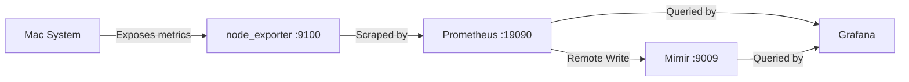
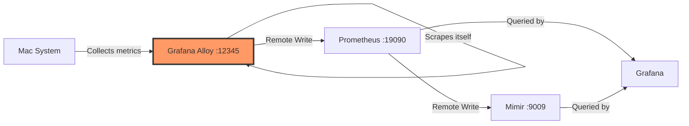
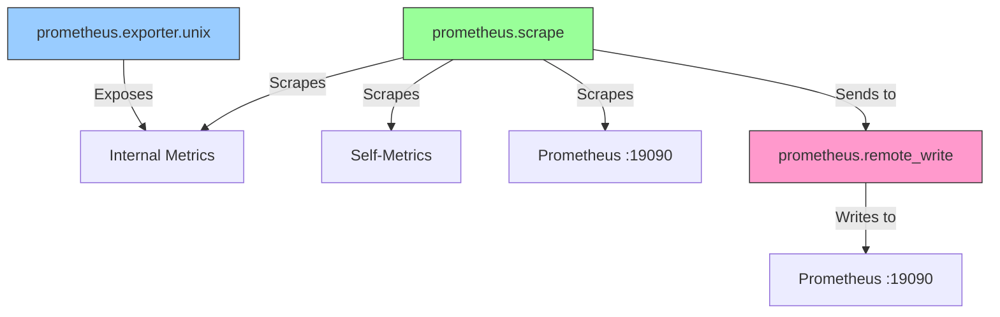

# Grafana Alloy Architecture

## Overview

This document outlines the architecture for replacing **node_exporter** with **Grafana Alloy** in the existing monitoring stack.

## Current Architecture (Before Migration)



### Current Components

| Component | Port | Purpose | Status |
|-----------|------|---------|--------|
| **node_exporter** | 9100 | System metrics collector (CPU, memory, disk, network) | ✅ Running |
| **Prometheus** | 19090 | Time-series database & scraper | ✅ Running |
| **Mimir** | 9009 | Long-term metric storage | ✅ Running |
| **Grafana** | 3000 | Visualization & dashboards | ✅ Running |

### Current Prometheus Configuration

```yaml
scrape_configs:
  - job_name: 'prometheus'
    static_configs:
      - targets: ['localhost:19090']

  - job_name: 'node_exporter'
    static_configs:
      - targets: ['localhost:9100']
```

---

## New Architecture (After Migration)



### New Component

| Component | Port | Purpose | Replaces |
|-----------|------|---------|----------|
| **Grafana Alloy** | 12345 | Unified telemetry collector (metrics, logs, traces) | node_exporter |

---

## Why Grafana Alloy?

### Key Advantages Over node_exporter

1. **Unified Agent**: Single agent for metrics, logs, traces, and profiles (vs. multiple agents)
2. **Built-in Exporters**: Includes `prometheus.exporter.unix` component (equivalent to node_exporter)
3. **OpenTelemetry Compatible**: OTLP native support for modern observability
4. **Flexible Pipelines**: Receivers → Processors → Exporters architecture
5. **Future-Ready**: Successor to Grafana Agent, actively maintained
6. **Additional Capabilities**:
   - Native Prometheus scraping and remote write
   - Log collection (Loki integration)
   - Trace collection (Tempo integration)
   - Dynamic configuration from Git/S3/HTTP
   - Built-in clustering for HA

---

## Grafana Alloy Architecture

### Component Pipeline



### Alloy Components

| Component | Purpose |
|-----------|---------|
| `prometheus.exporter.unix` | Collects system metrics (replaces node_exporter functionality) |
| `prometheus.scrape` | Scrapes metrics from exporters and targets |
| `prometheus.remote_write` | Sends metrics to Prometheus via remote write |
| `discovery.relabel` | Relabels and filters metrics |

---

## Configuration Strategy

### Alloy Configuration (River Syntax)

Grafana Alloy uses **River** configuration language (similar to HCL):

```river
// Component 1: Unix Exporter (replacement for node_exporter)
prometheus.exporter.unix "local" {
  // Enable all collectors by default
}

// Component 2: Scrape local unix exporter
prometheus.scrape "unix_metrics" {
  targets    = prometheus.exporter.unix.local.targets
  forward_to = [prometheus.remote_write.prometheus.receiver]
  
  scrape_interval = "15s"
}

// Component 3: Scrape Prometheus itself
prometheus.scrape "prometheus_metrics" {
  targets = [{
    __address__ = "localhost:19090",
  }]
  forward_to = [prometheus.remote_write.prometheus.receiver]
  
  scrape_interval = "15s"
}

// Component 4: Remote write to Prometheus
prometheus.remote_write "prometheus" {
  endpoint {
    url = "http://localhost:19090/api/v1/write"
  }
}
```

### Migration Path

1. **Install Alloy**: Via Homebrew
2. **Configure Alloy**: Create `/opt/homebrew/etc/alloy/config.alloy`
3. **Start Alloy**: Run as a service via Homebrew
4. **Verify Metrics**: Check metrics are flowing to Prometheus
5. **Stop node_exporter**: Disable the old service
6. **Update Prometheus**: Optional - remove node_exporter scrape config (since Alloy pushes via remote write)

---

## Updated Prometheus Configuration

After migration, Prometheus will receive metrics via **remote write** from Alloy:

```yaml
global:
  scrape_interval: 15s
  evaluation_interval: 15s
  external_labels:
    cluster: 'local-mac'
    environment: 'development'

# Remote write to Mimir (existing)
remote_write:
  - url: http://localhost:9009/api/v1/push
    headers:
      X-Scope-OrgID: demo

# Scrape configs (Alloy handles most scraping now)
scrape_configs:
  # Keep this to allow Prometheus to scrape itself
  - job_name: 'prometheus'
    static_configs:
      - targets: ['localhost:19090']
  
  # Optional: Can remove node_exporter since Alloy pushes via remote write
  # - job_name: 'node_exporter'
  #   static_configs:
  #     - targets: ['localhost:9100']
```

---

## Metrics Flow

### Before (node_exporter)
```
Mac System → node_exporter → Prometheus (scrape) → Mimir (remote write) → Grafana
```

### After (Grafana Alloy)
```
Mac System → Alloy (unix exporter) → Alloy (scraper) → Prometheus (remote write) → Mimir → Grafana
```

---

## Network Ports

| Component | Port | Protocol | Purpose |
|-----------|------|----------|---------|
| Grafana Alloy | 12345 | HTTP | Metrics endpoint & UI |
| Prometheus | 19090 | HTTP | Metrics & API |
| Mimir | 9009 | HTTP | Remote write endpoint |
| Grafana | 3000 | HTTP | Web UI |
| ~~node_exporter~~ | ~~9100~~ | ~~HTTP~~ | **Removed** |

---

## Benefits of This Architecture

1. **Simplified Stack**: One less service to manage (node_exporter removed)
2. **Centralized Configuration**: All scraping logic in Alloy
3. **Scalability**: Easy to add new exporters (postgres, mysql, etc.) to Alloy
4. **Future Extensions**: Can add logs (Loki) and traces (Tempo) without new agents
5. **Consistent Metrics**: Single agent ensures consistent labeling and processing
6. **Better Resource Usage**: Alloy is more efficient than running multiple exporters

---

## Migration Checklist

- [ ] Install Grafana Alloy via Homebrew
- [ ] Create Alloy configuration file
- [ ] Start Alloy service
- [ ] Verify metrics in Prometheus
- [ ] Verify dashboards in Grafana
- [ ] Stop node_exporter service
- [ ] Remove node_exporter from Homebrew services
- [ ] Update documentation

---

## Rollback Plan

If issues occur during migration:

1. **Stop Alloy**: `brew services stop alloy`
2. **Restart node_exporter**: `brew services start node_exporter`
3. **Restore Prometheus config**: Keep node_exporter scrape job enabled
4. **Investigate**: Check Alloy logs in `/opt/homebrew/var/log/alloy.log`

---

## Next Steps

1. Review this architecture
2. Proceed with implementation plan
3. Execute migration
4. Verify all components are working
5. Document the new setup
