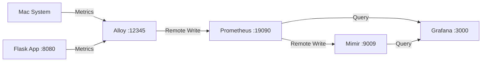
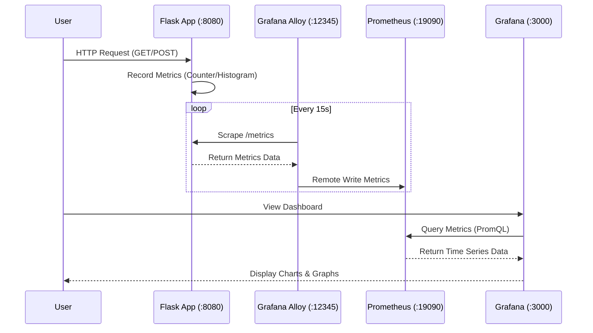

# Complete Walkthrough: Flask Application Metrics with Grafana, Alloy & Prometheus

## Overview

This walkthrough documents the complete setup of an observability stack using:
- **Grafana Alloy** - Unified telemetry collector (replaced node_exporter)
- **Prometheus** - Time-series database
- **Grafana** - Visualization and dashboards
- **Flask Demo App** - Python application instrumented with Prometheus metrics

---

## Part 1: Migrating from node_exporter to Grafana Alloy

### What We Did

**Replaced** node_exporter with Grafana Alloy for better observability capabilities.

### Architecture Change

**Before:**
```
Mac System → node_exporter → Prometheus → Mimir → Grafana
```

**After:**
```
Mac System → Alloy (unix exporter) → Prometheus → Mimir → Grafana
```

### Installation Steps

1. **Installed Grafana Alloy v1.11.3**
   ```bash
   brew install grafana/grafana/alloy
   ```

2. **Created Alloy Configuration** (`config.alloy`)
   - Unix system metrics exporter (replaces node_exporter)
   - Scrape jobs for unix metrics and Prometheus
   - Remote write to Prometheus

3. **Updated Prometheus** - Added `--web.enable-remote-write-receiver` flag
   ```bash
   echo "--web.enable-remote-write-receiver" >> /opt/homebrew/etc/prometheus.args
   brew services restart prometheus
   ```

4. **Started Alloy Service**
   ```bash
   brew services start grafana/grafana/alloy
   ```

5. **Stopped node_exporter**
   ```bash
   brew services stop node_exporter
   ```

### Verification

✅ **58 node metrics** now collected by Alloy  
✅ Metrics flowing to Prometheus via remote write  
✅ All services running: Alloy, Prometheus, Mimir, Grafana  

---

## Part 2: Flask Application with Prometheus Metrics

### Application Overview

Created a demo Flask application that exposes Prometheus metrics for observability.

**Location**: `flask_demo/app.py`

### Features Implemented

#### 5 HTTP Endpoints
1. `/` - Home page
2. `/api/users` - Get users (demo data)
3. `/api/orders` - Create order (POST)
4. `/api/health` - Health check
5. `/metrics` - Prometheus metrics endpoint

#### Metric Types

**1. Request Metrics (Standard)**
- `flask_http_requests_total` - Counter: Total HTTP requests by method, endpoint, status
- `flask_http_request_duration_seconds` - Histogram: Request latency

**2. Business Metrics (Custom)**
- `app_orders_created_total` - Counter: Total orders created
- `app_revenue_total` - Counter: Total revenue in USD
- `app_active_users` - Gauge: Current active users

**3. System Metrics (Application Health)**
- `app_info` - Info: Application version and environment
- `app_uptime_seconds` - Gauge: Application uptime

### Code Highlights

**Defining Metrics:**
```python
from prometheus_client import Counter, Histogram, Gauge

http_requests_total = Counter(
    'flask_http_requests_total',
    'Total HTTP requests',
    ['method', 'endpoint', 'status']
)
```

**Automatic Request Tracking:**
```python
@app.after_request
def after_request(response):
    http_requests_total.labels(
        method=request.method,
        endpoint=endpoint,
        status=response.status_code
    ).inc()
    return response
```

### Installation

```bash
cd flask_demo
pip3 install -r requirements.txt
python3 app.py
```

**Dependencies:**
- Flask 3.0.0
- prometheus-client 0.19.0
- Werkzeug 3.0.1

---

## Part 3: Alloy Configuration for Flask

### Updated config.alloy

Added a new scrape job to collect Flask metrics:

```river
prometheus.scrape "flask_app" {
  targets = [{
    __address__ = "localhost:8080",
  }]
  forward_to = [prometheus.remote_write.prometheus.receiver]
  
  scrape_interval = "15s"
  job_name = "flask-demo"
}
```

### Deployment

```bash
# Copy config
cp config.alloy /opt/homebrew/etc/alloy/config.alloy

# Restart Alloy
brew services restart grafana/grafana/alloy
```

---

## Part 4: Grafana Dashboard

### Access

- **URL**: http://localhost:3000
- **Default Login**: admin / admin

### PromQL Queries Used

#### 1. Request Rate
```promql
rate(flask_http_requests_total[1m])
```
Shows per-second request rate over 1-minute window.

#### 2. Total Orders Created
```promql
app_orders_created_total
```
Cumulative count of orders.

#### 3. Total Revenue
```promql
app_revenue_total
```
Total revenue in USD.

#### 4. Request Rate by Endpoint
```promql
sum by (endpoint) (rate(flask_http_requests_total[1m]))
```

#### 5. 95th Percentile Latency
```promql
histogram_quantile(0.95, rate(flask_http_request_duration_seconds_bucket[5m]))
```

#### 6. Error Rate
```promql
sum(rate(flask_http_requests_total{status="500"}[1m]))
```

### Creating Panels

1. Click "New" → "New dashboard"
2. Click "Add visualization"
3. Select "prometheus" data source
4. Switch to "Code" mode
5. Enter PromQL query
6. Set panel title
7. Click "Apply"

---

## Part 5: Testing & Verification

### Generate Traffic

```bash
# Generate 20 requests to each endpoint
for i in {1..20}; do 
  curl -s http://localhost:8080/ > /dev/null
  curl -s http://localhost:8080/api/users > /dev/null
  curl -s -X POST http://localhost:8080/api/orders > /dev/null
  sleep 0.3
done
```

### Verify Metrics in Prometheus

```bash
# Check Flask metrics exist
curl -s 'http://localhost:19090/api/v1/query?query=flask_http_requests_total' | jq

# Check specific metric
curl -s 'http://localhost:19090/api/v1/query?query=app_orders_created_total' | jq
```

### Service Health Check

```bash
# Check all services
brew services list | grep -E "(alloy|prometheus|grafana)"

# Check Flask
curl http://localhost:8080/api/health
```

---

## Architecture Overview



### Data Collection Flow



---

## Current Status

| Service | Status | Port | Purpose |
|---------|--------|------|---------|
| **Grafana Alloy** | ✅ Running | 12345 | Telemetry collector |
| **Prometheus** | ✅ Running | 19090 | Metrics database |
| **Grafana** | ✅ Running | 3000 | Dashboards |
| **Flask Demo** | ✅ Running | 8080 | Application metrics |
| **Mimir** | ✅ Running | 9009 | Long-term storage |

---

## Key Files

```
Grafana_alloy/
├── README.md                    # Project overview
├── ARCHITECTURE.md              # Detailed architecture docs
├── config.alloy                 # Alloy configuration
├── prometheus.args              # Prometheus startup args
└── flask_demo/
    ├── app.py                   # Flask application
    ├── requirements.txt         # Python dependencies
    └── README.md               # Flask app docs
```

---

## Metrics Collected

### System Metrics (via Alloy)
- CPU usage, load average
- Memory (total, used, cached, free)
- Disk I/O rates
- Network traffic
- Filesystem usage

### Application Metrics (via Flask)
- HTTP request count and rate
- Request latency (histogram)
- Business metrics (orders, revenue)
- Application uptime
- Active users

---

## Troubleshooting

### Flask App Not Responding
```bash
# Check if running
lsof -i :8080

# Restart
pkill -f "python3 app.py"
cd flask_demo && python3 app.py &
```

### Metrics Not in Prometheus
```bash
# Check Alloy logs
tail -f /opt/homebrew/var/log/alloy.err.log

# Restart Alloy
brew services restart grafana/grafana/alloy
```

### Grafana Not Loading
```bash
# Check health
curl http://localhost:3000/api/health

# Restart
brew services restart grafana
```

---

## Next Steps

### Enhancements You Can Make

1. **Add More Exporters**
   - MySQL/PostgreSQL exporter
   - Redis exporter
   - Custom application exporters

2. **Log Collection**
   - Add Loki for log aggregation
   - Configure log collection in Alloy

3. **Alerting**
   - Set up Prometheus alerting rules
   - Configure Alertmanager
   - Create alert notifications

4. **Dashboard Improvements**
   - Add more panels (error rates, latency percentiles)
   - Create dashboard variables for filtering
   - Set up auto-refresh

5. **Production Readiness**
   - Use production WSGI server (Gunicorn)
   - Add authentication to Flask app
   - Implement rate limiting
   - Add more comprehensive error handling

---

## Quick Reference Commands

```bash
# Start Flask app
cd flask_demo && python3 app.py

# Generate traffic
for i in {1..10}; do curl -s http://localhost:8080/ > /dev/null; done

# Check metrics
curl http://localhost:8080/metrics | grep flask_

# Query Prometheus
curl 'http://localhost:19090/api/v1/query?query=flask_http_requests_total'

# Restart services
brew services restart grafana/grafana/alloy
```

---

## Learning Outcomes

✅ Migrated from node_exporter to Grafana Alloy  
✅ Instrumented Python Flask app with Prometheus metrics  
✅ Configured Alloy to scrape custom applications  
✅ Created Grafana dashboards with PromQL queries  
✅ Understood Counter, Histogram, and Gauge metric types  
✅ Built complete observability stack on macOS  

---

## Resources

- [Grafana Alloy Documentation](https://grafana.com/docs/alloy/latest/)
- [Prometheus Documentation](https://prometheus.io/docs/)
- [Prometheus Python Client](https://github.com/prometheus/client_python)
- [PromQL Cheat Sheet](https://promlabs.com/promql-cheat-sheet/)

---

